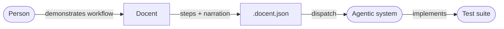

<h1>Docent</h1>

> Demonstrated Behaviour Capture and Dispatch

Docent captures user interactions alongside step-by-step narration and exports the result as structured JSON. It runs as a Chrome extension for browser workflows and as a native desktop application (Windows) for native application workflows. Both platforms produce the same `.docent.json` output format.

---

## What it does

Docent captures interactions and pairs them with narration for each step. The result is a `.docent.json` file that describes what happened, in order, with full context.

- **Chrome extension** — captures DOM events in the browser (clicks, typing, navigation, tab lifecycle, drag, scroll, keyboard)
- **Desktop application** — captures native application interactions on Windows via the UI Automation accessibility API, with per-action coordinate-based fallback for elements that lack accessibility data

Active steps can be dispatched directly to a configured HTTP endpoint from either platform — no terminal or Node.js required.

See [Capture Principles](docs/capture-principles.md) for the rules governing what is and isn't captured.

---

## How this differs

Most browser recording tools produce code — Playwright scripts, Selenium tests, Puppeteer flows. They assume you want to replay what was recorded, and they assume a specific framework to replay it in.

Docent produces data, not code. Each step is a pair: what was narrated, and what actually happened. The output makes no assumptions about what receives it or what it does with it.

The dispatch payload includes a reading guide that describes the data format, so any receiving system can interpret it without prior knowledge of Docent.

---

## Example flow



A person demonstrates a workflow once. Docent captures each step — the narration and the interactions. The structured output is dispatched to an agentic system that produces a test suite.

The `.docent.json` format is the contract between capture and consumption.

---

## Version compatibility

<!-- VERSION_TABLE_START -->
| Schema | Extension | Desktop |
|--------|-----------|---------|
| 2.0.0  | 2.0.0+   | 1.0.0+  |
<!-- VERSION_TABLE_END -->

---

## Chrome Extension

### Installation (development)

1. Clone the repo

```bash
git clone https://github.com/Arsarneq/docent.git
cd docent
```

2. Sync shared code and install test dependencies

```bash
npm run dev:extension
cd packages/extension && npm install
```

3. Open `chrome://extensions` in Chrome
4. Enable **Developer mode** (top right)
5. Click **Load unpacked** and select the `packages/extension/` folder
6. The Docent icon appears in the Chrome toolbar

### Using the extension

#### Create a project

1. Click the Docent icon — the side panel opens
2. Click **+ New** to create a project
3. Click **+ New recording** — recording begins immediately

#### Record steps

1. Perform the actions in the browser
2. Type the narration for the step
3. Click **Done this step**
4. Repeat for each step

The **Done this step** button is disabled until at least one action has been recorded.

**Clear** discards the recorded actions for the current step without committing the step.

#### Edit steps

| Control | Action |
|---|---|
| Click narration | View recorded actions for that step (read-only) |
| Pencil icon | Re-record — replace narration and actions for a step |
| Clock icon | History — view all previous versions of a step |
| Trash icon | Delete — soft delete, history preserved |
| Drag | Reorder steps |

#### Export

Click **Export** on the project view to download a `.docent.json` file.

#### Import

Click **Import** on the projects list to load a previously exported `.docent.json` file.

### Send (extension)

Dispatch active steps directly from the extension — no terminal or Node.js required.

#### Configure the endpoint

1. Click the gear icon to open Settings
2. Enter the **Dispatch endpoint** URL (must start with `http://` or `https://`)
3. Optionally enter an **API key** — sent as `Authorization: Bearer <key>`
4. Click **Save**

Local endpoints (e.g. `http://localhost:3000`) are supported.

#### Send a recording

1. Open a project
2. Click **Send** — the button is enabled when an endpoint is configured and the project has recordings with active steps
3. If the project has multiple recordings with active steps, choose which to send (or **Send all**)
4. Review the endpoint URL, recording name(s), and step count in the confirmation view
5. Click **Send** to dispatch — a success or error message is shown

---

## Desktop Application (Windows)

### Prerequisites

- Windows 10 or later
- [Rust toolchain](https://rustup.rs/) (for building from source)
- Node.js 20+

### Installation (development)

1. Clone the repo and sync shared code

```bash
git clone https://github.com/Arsarneq/docent.git
cd docent
npm run sync-shared
npm run build:desktop-dist
```

2. Build and run the Tauri application in dev mode

```bash
cd packages/desktop/src-tauri
cargo tauri dev
```

Or build a release binary:

```bash
cd packages/desktop/src-tauri
cargo tauri build
```

### Using the desktop app

The desktop app provides the same workflow as the Chrome extension:

1. Create a project and a recording
2. Select a target application from the list of running windows
3. Perform actions in native applications — interactions are captured automatically
4. Type the narration for each step and click **Done this step**
5. Export as `.docent.json` or dispatch directly to an endpoint

The desktop capture layer uses the Windows UI Automation accessibility API for rich element descriptions. When an element lacks accessibility data, it falls back to coordinate-based capture for that individual action. A single recording can contain a mix of both modes.

### Send (desktop)

The dispatch workflow is identical to the extension. Configure an endpoint in Settings, then click **Send** on a project.

---

## Session format

The `.docent.json` format is defined by a [JSON Schema](packages/shared/session.schema.json) (v2.0.0) — the single source of truth shared across all Docent platforms.

---

## Contributing

See [.github/CONTRIBUTING.md](.github/CONTRIBUTING.md).

All contributors must sign the [CLA](CLA.md). The CLA Assistant bot handles this automatically on pull requests.

---

## Licence

[GNU General Public License v3.0](LICENSE)

Free to use privately or within your organisation without obligation.
Modified versions distributed publicly must be released under GPL-3.0.
