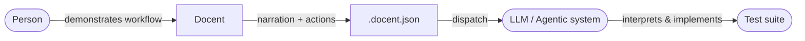
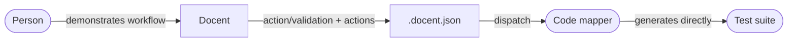

[](https://github.com/Arsarneq/docent/actions/workflows/test.yml)
[](https://codecov.io/gh/Arsarneq/docent)
[>)](https://app.codecov.io/gh/Arsarneq/docent?flags%5B0%5D=javascript)
[>)](https://app.codecov.io/gh/Arsarneq/docent?flags%5B0%5D=rust)
[](https://github.com/Arsarneq/docent/actions/workflows/mutation.yml)
[](https://github.com/Arsarneq/docent/security/code-scanning)
[](https://chromewebstore.google.com/detail/docent/odhpdgpoknpaakjdkdbjdgpljmpblijh)
[](https://github.com/Arsarneq/docent/releases/tag/desktop-v2.0.0)
[](https://nodejs.org/)
[](https://tauri.app/)
[](.github/CONTRIBUTING.md)
[](LICENSE)
[](packages/desktop)

<h1>Docent</h1>

> Captures demonstrated workflows as structured data — not code.

Docent captures user interactions alongside step-by-step context and exports the result as structured JSON. It runs as a Chrome extension for browser workflows and as a native desktop application (Windows) for native application workflows. Both platforms produce `.docent.json` files with the same core structure, differentiated by platform-specific action types and fields.

---

## What it does

Docent captures interactions and pairs them with step-by-step context. The result is a `.docent.json` file that describes what happened, in order, with full context.

- **Chrome extension** — captures user actions in the browser: clicks, typing, keyboard, drag, scroll, file uploads. Browser chrome actions (address bar, back/forward, tabs) are captured via their immediate effects.
- **Desktop application** — captures user actions in native Windows applications via low-level input hooks and the UI Automation accessibility API, with per-action coordinate-based fallback for elements that lack accessibility data.

Both platforms follow the same principle: every captured action is a real user action — nothing programmatic, synthetic, or inferred. Programmatic side-effects (value changes from code, focus moves from scripts, window lifecycle from `window.open()`) are filtered out. A small amount of observed context is recorded alongside the actions to describe them faithfully, always kept distinct from the actions themselves.

Sensitive values are redacted at capture time on both platforms — passwords, credit-card / SSN / secret field values, and auth tokens in captured URLs are masked before anything is stored.

Recordings can be dispatched directly to a configured HTTP endpoint from either platform — no terminal or Node.js required.

See [Capture Principles](docs/capture-principles.md) for the full rules, with platform-specific details in [Extension](docs/capture-principles-extension.md) and [Desktop](docs/capture-principles-desktop.md).

---

## How this differs

Most browser recording tools produce code — Playwright scripts, Selenium tests, Puppeteer flows. They assume you want to replay what was recorded, and they assume a specific framework to replay it in.

Docent produces data, not code. Each step pairs context — either a free-text narration or a structured action/validation classification — with the exact interactions captured. The output makes no assumptions about what receives it or what it does with it.

The dispatch payload includes a reading guide and the JSON Schema for the sending platform, so any receiving system can interpret it without prior knowledge of Docent.

---

## Example flow

### Agentic consumer (narration mode)



A person demonstrates a workflow, narrating each step in natural language. The structured output is dispatched to an agentic system (LLM) that interprets the narration and captured interactions to produce a test suite. The LLM has full context — what the user did and what they meant.

### Deterministic consumer (simple mode)



A person demonstrates a workflow, tagging each step as either "action" (do this) or "validation" (check this). A deterministic code mapper generates framework-specific test code directly from the structured data — no LLM required. Each action step becomes a replay command, each validation step becomes an assertion.

### The format is the contract

Both paths consume the same `.docent.json` format. Docent captures and delivers — it has no opinion about what receives the data or how it's used.

Docent ships the format — the schema, the spec, and the self-describing stamp. It does not ship a consumer, and includes no example consumer implementation. That is by design: the format is the contract; what you build against it is yours.

---

## Schema versions

The current `.docent.json` schema version for each platform. Exported files are
self-describing — each carries a `docent_format` stamp with its platform and
schema version — so you never need to match versions by hand.

<!-- VERSION_TABLE_START -->

| Platform          | Schema version |
| ----------------- | -------------- |
| Chrome Extension  | 3.0.0          |
| Desktop (Windows) | 2.0.0          |

<!-- VERSION_TABLE_END -->

See [docs/session-format.md](docs/session-format.md#versioning) for the full versioning strategy.

---

## Chrome Extension

### Installation (development)

1. Clone the repo

```bash
git clone https://github.com/Arsarneq/docent.git
cd docent
```

2. Sync shared code and install test dependencies

```bash
npm run dev:extension
cd packages/extension && npm install
```

3. Open `chrome://extensions` in Chrome
4. Enable **Developer mode** (top right)
5. Click **Load unpacked** and select the `packages/extension/` folder
6. The Docent icon appears in the Chrome toolbar

### Using the extension

#### Create a project

1. Click the Docent icon — the side panel opens
2. Click **+ New** to create a project
3. Click **+ New recording** — recording begins immediately

#### Record steps

1. Perform the actions in the browser
2. Provide context for the step (type narration in narration mode, or select action/validation in simple mode)
3. Click **Done this step**
4. Repeat for each step

The **Done this step** button is disabled until at least one action has been recorded.

**Clear** discards the recorded actions for the current step without committing the step.

#### Edit steps

| Control         | Action                                               |
| --------------- | ---------------------------------------------------- |
| Click narration | View recorded actions for that step (read-only)      |
| Pencil icon     | Re-record — replace narration and actions for a step |
| Clock icon      | History — view all previous versions of a step       |
| Trash icon      | Delete — soft delete, history preserved              |
| Drag            | Reorder steps                                        |

#### Export

Click **Export** on the project view to download a `.docent.json` file.

#### Import

Click **Import** on the projects list to load a previously exported `.docent.json` file.

### Send (extension)

Dispatch recordings directly from the extension — no terminal or Node.js required.

#### Configure the endpoint

1. Click the gear icon to open Settings
2. Enter the **Dispatch endpoint** URL (must start with `http://` or `https://`)
3. Optionally enter an **API key** — sent as `Authorization: Bearer <key>`
4. Click **Save**

Local endpoints (e.g. `http://localhost:3000`) are supported.

#### Send a recording

1. Open a project
2. Click **Send** — the button is enabled when an endpoint is configured and the project has recordings with steps
3. If the project has multiple recordings, choose which to send (or **Send all**)
4. Review the endpoint URL, recording name(s), and step count in the confirmation view
5. Click **Send** to dispatch — the full recording history is sent. A success or error message is shown

---

## Desktop Application (Windows)

### Prerequisites

- Windows 10 or later
- [Rust toolchain](https://rustup.rs/) (for building from source)
- Node.js 24+

### Installation (development — desktop)

1. Clone the repo and sync shared code

```bash
git clone https://github.com/Arsarneq/docent.git
cd docent
npm run sync-shared
npm run build:desktop-dist
```

2. Build and run the Tauri application in dev mode

```bash
cd packages/desktop/src-tauri
cargo tauri dev
```

Or build a release binary:

```bash
cd packages/desktop/src-tauri
cargo tauri build
```

### Using the desktop app

The desktop app provides the same workflow as the Chrome extension:

1. Create a project and a recording
2. Select a target application from the list of running windows
3. Perform actions in native applications — interactions are captured automatically
4. Provide context for each step and click **Done this step**
5. Export as `.docent.json` or dispatch directly to an endpoint

The desktop capture layer uses the Windows UI Automation accessibility API for rich element descriptions. When an element lacks accessibility data, it falls back to coordinate-based capture for that individual action. A single recording can contain a mix of both modes.

### Send (desktop)

The dispatch workflow is identical to the extension. Configure an endpoint in Settings, then click **Send** on a project.

---

## Session format

The `.docent.json` format is defined by per-platform JSON Schemas — the single source of truth for each Docent platform:

- [Extension schema](schemas/dist/extension.schema.json) — Chrome extension
- [Desktop Windows schema](schemas/dist/desktop-windows.schema.json) — Windows desktop

See [docs/session-format.md](docs/session-format.md) for the full specification with annotated examples.

---

## Contributing

See [.github/CONTRIBUTING.md](.github/CONTRIBUTING.md).

All contributors must sign the [CLA](CLA.md). The CLA Assistant bot handles this automatically on pull requests.

---

## Licence

[GNU General Public License v3.0](LICENSE)

Free to use privately or within your organisation without obligation.
Modified versions distributed publicly must be released under GPL-3.0.
