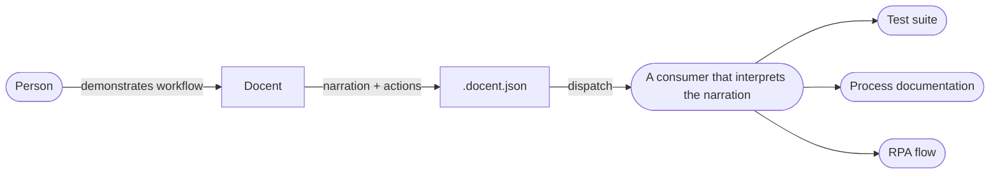
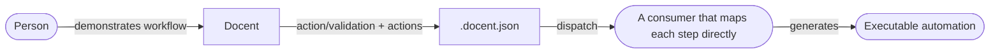

# Product Positioning

Where Docent sits relative to other recording tools, and the contract it makes
with whatever consumes a recording. The [root README](../../../README.md) carries
a short distillation of this and points here for the full statement.

---

## How this differs

Most browser recording tools produce code — a script that plays the recording
back. They assume you want to replay what was recorded, and they assume a
specific automation framework to replay it in.

Docent produces data, not code. Each step pairs context — either a free-text
narration or a structured action/validation classification — with the exact
interactions captured. The output makes no assumptions about what receives it or
what it does with it.

The dispatch payload includes a reading guide and the JSON Schema for the sending
platform, so any receiving system can interpret it without prior knowledge of
Docent.

---

## Example consumers

> Docent ships no consumer. Its contract with a consumer is data — the
> `.docent.json` format, a versioned JSON Schema per platform; whatever reads a
> recording is built separately and independently. The reference sync server is a
> sync target — somewhere to store and exchange sessions — not a consumer of the
> format. The flows below are **examples** of what a consumer _could_ do — Docent
> makes no assumptions about which of them (if any) receives a recording.

The two flows differ only in the **step context** each mode records, and so in
what a consumer must do to interpret it.

### Narration mode

A person demonstrates a workflow, narrating each step in natural language. The
step context is free-text intent, so a consumer interprets that language against
the captured actions — with full context of what the user did and what they
meant — and can turn it into whatever it is built for: a test suite, written
process documentation, an RPA flow, an accessibility report. Docent neither
performs nor ships any of this; it delivers the data.

### Simple mode

A person demonstrates a workflow, tagging each step as either "action" (do this)
or "validation" (check this). The step context is already classified, so a
consumer can map each step directly to an executable operation: an action step
becomes a replay operation, a validation step becomes an assertion. A test suite
is one such target; the same do/check shape maps just as cleanly to an RPA flow
or a monitoring check.

### The contract is data

Both paths consume the same `.docent.json` format. Docent captures and
delivers — it has no opinion about what receives the data or how it's used.
The same rule holds at every surface Docent exposes: recordings are defined by
per-platform versioned [JSON Schemas](../../technical/session-format.md),
dispatch payloads carry their own schema and reading guide, and sync servers
implement a documented [REST protocol](../../api/sync-protocol.md). Each contract
is data; none of it is shipped code.

The affirmative half of that neutrality is a promise about the data itself:
**replay sufficiency** — assuming the application unchanged, a consumer holding
only the recording can reproduce the session from a different machine. See
[Replay Sufficiency](../replay-sufficiency.md) for the principle, its scope
boundaries, and what makes it testable.
